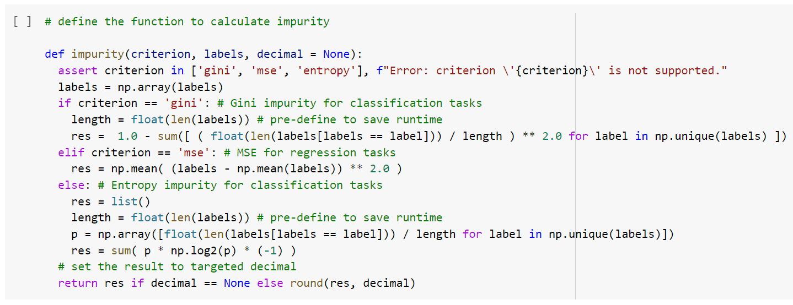
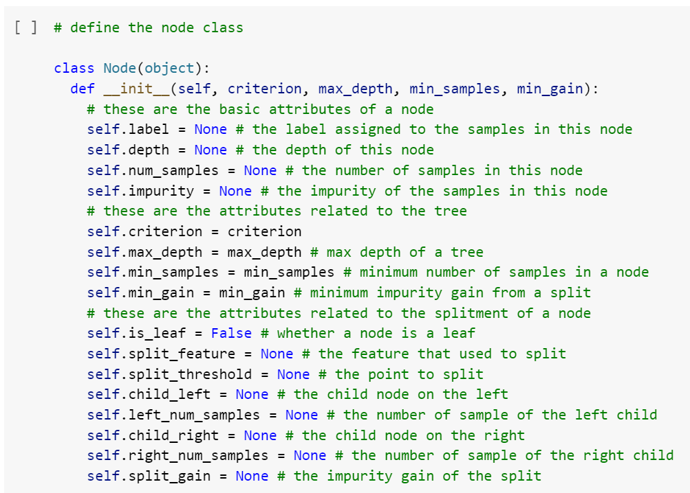
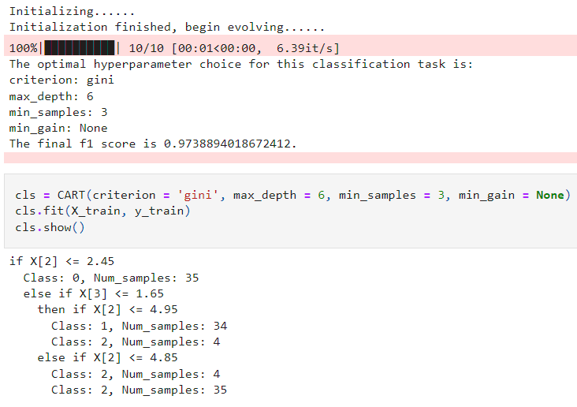

# Ensemble-Learning Group Project

by Congjie **AN**, Jialin **DU**, Zeli **PAN**, Yifan **WANG**

This is the ensemble-learning group project of DSBA program, ESSEC & CentraleSupélec. This group project consists of two parts:
- a kaggle competition to predict Airbnb price in New York
- an implementation of decision tree from scratch (CART.ipynb)

For each part, there are detailed steps in the jupyter notebooks. For the convenience of understanding, we show the **description of part II** here.

---

## PART 2 Decision Tree Implementation

In this part, we use **only numpy** to implement a Classification And Regression Tree (**CART**) from scratch. The entire implementation is divided into four parts:
- 1.1 Construction of the CART.
- 1.2 Evaluation on both classification and regression tasks.
- 2.1 An evolutionary algorithm for hyperparameter tuning.
- 2.2 Optimized CART performance.

### 2.1.1 CART Construction

In this part, we use a lot of recursive functions to reduce the complexity of the code by sacrificing memories. We first define a function to calculate the impurity:

This function supports three kinds of impurity: `'gini'`, `'entropy'` and `'mse'`, and can set the decimal of the returned value. In subsequent calculations, we uniformly set the decimal of the impurity to 4.

Next we define the `Node` class. The attributes contained in this class are as follows:

`Node` class contains three functions:  `grow`, `predict` and `show`; each is a recursive function.
- `grow`: This function will loop all features and in each feature, loop all thresholds and calculate the impurity gain of each splitting threshold (`self.split_gain`). After obtaining the optimal splitting feature and splitting threshold, the function will create new Node classes for the left child and right child respectively and call the `grow` function of the children again. This process will be interrupted by:
  - All samples in the Node belong to the same class.
  - The Node reaches the set `max_depth` (`self.depth == max_depth`).
  - The number of samples of at least one child of the Node is lower than the set threshold (`self.left/right_num_samples < min_samples`)
  - The impurity gain from a split of the Node is lower than the set threshold (`self.split_gain < min_gain`).
  After reaching these conditions, we set `self.is_leaf =True`.
- `predict`: This function will return the predicted label of a single sample (one row). It will be called repetitively in the left/right child Node according to its value compared to `self.split_threshold` until reaching a leaf Node.
- `show`: Similar to the functions above, this function is called repetitively and in each node it will print the splitting information (splitting feature, threshold, left/right child).

At last we define a `CART` class. The structure of this class is relatively simple, and its role is to pass parameters to the Node class, initialize the root Node, and initialize each recursive function.

### 2.1.2 CART Evaluation

In this part, we use the `Iris`, `Wine` and `Breast Cancer Wisconsin` (Diagnostic) datasets that come with the scikit-learn package for classification tasks, and use our own generated five-dimensional data for regression tasks. In each task, we compare the performance (on test set) of the custom CART with the `DecisionTreeClassifier` and `DecisionTreeRegressor` (both with same parameters) in scikit-learn. We will also print the CART structure.

As can be seen the results are almost the same.

### 2.2.1 Evolutionary Hyperparameter Tuning

In this part, we use the evolutionary algorithm to find the optimal parameter combination while avoiding the time-consuming grid search. The logic is as follows:
1. Input parameter range, for instance the value of `max_depth` can be None, 5, 6, 7, 8, etc.
2. Randomly generate ten samples as the parent generation, and calculate the performance of these ten samples (F1 score or MSE).
3. In each generation, we take the first 4 samples as parents, and exchange parameters with each other to generate offspring. The mutation probability is set to 30%.
4. After repeating the pre-set epoch (generation), we take the parameter combination with the best performance in the last generation as the final parameter combination output.
5. The performance of each generation is recorded in the 'history' variable, which can be set to print and plot.

Unfortunately, because the dataset inside sklearn is too simple, this function does not bring much improvement. However, based on the experience of using random forest and implementing evolutionary hyperparameter tuning in Kaggel competition in the past, this function can bring huge improvements in complex tasks.

### 2.2.2 CART with Optimized Parameters

In this part we repeat the tasks of 2.1.2, using the evolutionary algorithm to obtain the optimal parameter combination and applying it.

The result is clear and nice.
